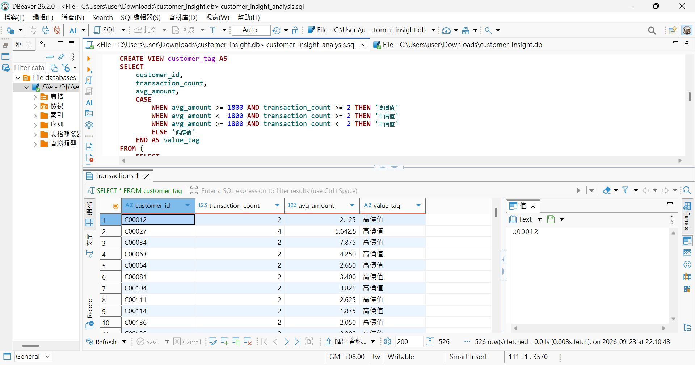
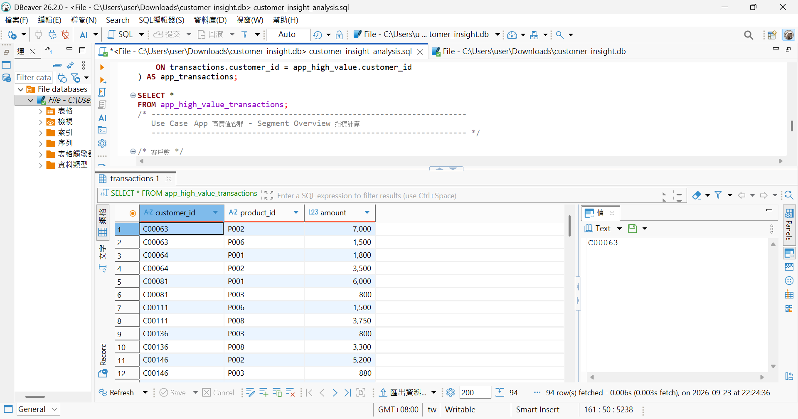

# 📊 CustomerInsight

## 專案名稱：CRM 客戶分群與交易分析

### **1. 專案目標**

透過客戶基本資料、交易紀錄與商品資料進行分析，找出不同客群的交易特徵，建立 CRM Tag 與 Customer Segment，進一步找出高價值客群，作為後續客戶經營與產品行銷規劃的參考。

<br>

### **2. 使用工具**

* **數據處理（ `MySQL`）**：
  使用 SQL 整合客戶、交易與商品資料，透過 `JOIN`、`GROUP BY`、`CASE WHEN`等方式進行資料分析，並依據交易頻率與平均交易金額建立客戶價值標籤。

<br>

### **3. 數據分析（MySQL）**

透過 SQL 分析不同通路、商品及客群的交易情況，主要分析項目包含：

1. **通路分析**：比較 App、Web、Branch 的客戶數與交易金額。
2. **商品分析**：比較不同商品類別的交易筆數與交易金額。
3. **客群分析**：分析不同年齡與地區客群的進階理財方案交易情況。
4. **客戶價值分析**：依據交易頻率與平均單筆交易金額建立 CRM Customer Value Tag。

<br>

### **4. CRM Tag Design**

依據客戶交易行為建立客戶價值標籤：

| 客戶價值    | 分類條件                         |
| ------- | ---------------------------- |
| **高價值** | 交易次數 ≥ 2 次，且平均單筆金額 ≥ 1,800 元 |
| **中價值** | 交易次數或平均單筆金額其中一項達標            |
| **低價值** | 交易次數 < 2 次，且平均單筆金額 < 1,800 元 |

透過 `CASE WHEN` 將交易資料轉換為 CRM Customer Value Tag，讓後續客群分群可以依據一致的條件進行分析。

```sql
CASE
    WHEN avg_amount >= 1800 AND transaction_count >= 2 THEN '高價值'
    WHEN avg_amount <  1800 AND transaction_count >= 2 THEN '中價值'
    WHEN avg_amount >= 1800 AND transaction_count <  2 THEN '中價值'
    ELSE '低價值'
END AS value_tag
```

> **執行結果**
>
> ** <br>

<br>

### **5. Customer Segment Design**

根據 CRM Tag 組合建立不同客戶群：

| Customer Segment | 分群條件        | 分析目的         |
| ---------------- | ----------- | ------------ |
| **App 高價值客群**    | App 使用者＋高價值 | 找出 App 高價值客戶 |
| **進階理財高價值客群**    | 進階理財＋高價值    | 找出高價值理財客戶    |
| **進階理財潛力客群**     | 進階理財＋中價值    | 找出具發展潛力的客戶   |

以「App 高價值客群」為例，在 `customer_tag` 分類基礎上，疊加通路條件篩出具體客群：

```sql
-- 在 customer_tag 分類基礎上，疊加通路條件
SELECT ...
FROM transactions
JOIN customer ON ...
JOIN customer_tag ON ...
WHERE customer.channel = 'App'
  AND customer_tag.value_tag = '高價值'
```

> **執行結果（App 高價值客群）**
>
> ** <br>

<br>


**觀察分析：**

App 高價值客群共 **44 人**，主要年齡層集中於：

20–29 歲：13 人
30–39 歲：13 人
40–49 歲：8 人
50+：10 人

<br>

地區分布則以：

北部：21 人
南部：17 人
中部：6 人

<br>

在商品交易方面，**Investment 為主要交易商品類別**：

Investment 交易筆數：49 筆
Investment 交易金額：419,700 元
Investment 金額占比：約 84%

**※App 高價值客群的交易金額主要集中於 Investment 商品，可作為後續產品推薦與客戶經營的參考。**

<br>

### **7. 問題分析**

**數據觀察：**

1. App 高價值客群主要集中於 20–39 歲。
2. 北部與南部客戶占此客群較高比例。
3. Investment 為主要交易商品，交易金額占比約 84%。
4. 進階理財方案的平均單筆交易金額較高，具有進一步分析的價值。

<br>

### **8. 應用方向**

根據 Customer Segment 與交易特徵，可以進一步將分析結果應用於 CRM 與產品經營：

1. **客戶分群**：依據年齡、地區、使用通路與客戶價值建立 CRM Tag。
2. **產品推薦**：針對高價值客戶推薦符合其交易偏好的 Investment 或進階理財產品。
3. **行銷活動**：依不同客群特徵設計個人化行銷內容。
4. **持續追蹤**：透過後續交易資料觀察不同客群的轉換與交易變化。

<br>

### **9. 分析流程**

**Customer Data**
↓
**SQL Data Analysis**
↓
**CRM Tag**
↓
**Customer Segment**
↓
**Customer Insight**
↓
**Product / Marketing Action**

透過 SQL  將原始客戶資料轉換為可應用於 CRM 與產品規劃的分析結果。
